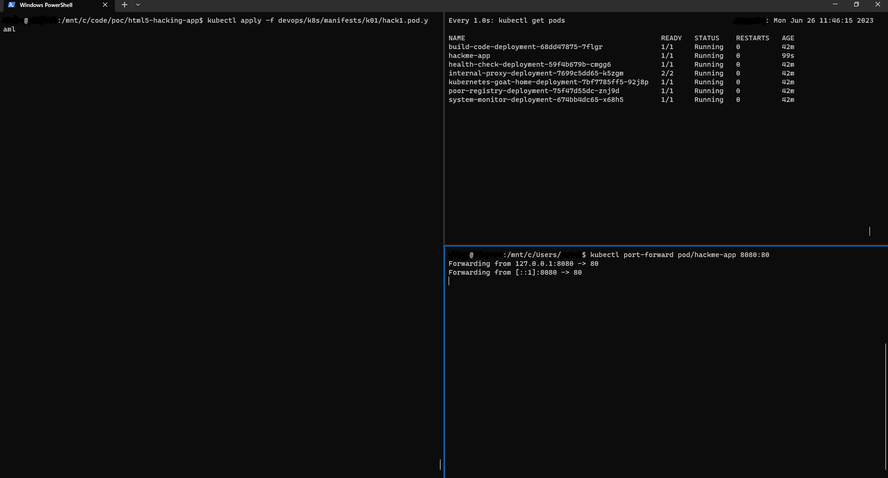

# Hack Me App

Original creator ldynia

This stateless application was implemented for the purpose of being hacked.

## Installation

### Docker for desktop

1. Install local kubernetes cluster with [Docker Desktop](https://www.docker.com/products/docker-desktop/)
    1. Open `Docker Desktop`
    1. In `Settings > Kubernetes` check `Enable Kubernetes` checkbox
    1. Restart `Docker Desktop`
1. install [az](https://learn.microsoft.com/en-us/cli/azure/install-azure-cli) CLI
1. install `kubectl` with `az aks install-cli` command

```bash

# Use cluster k8s docker-desktop or minikube
kubectl config get-contexts
kubectl config set-context docker-desktop
```

### Kubernetes Goat

- Read [kubernetes goat docs](https://madhuakula.com/kubernetes-goat/docs/)
- Read [OWASP Kubernetes Top Ten](https://owasp.org/www-project-kubernetes-top-ten/)
- Execute [OWASP Kubernetes Top Ten](https://madhuakula.com/kubernetes-goat/docs/owasp-kubernetes-top-ten)

1. Set up the cluster

    ```shell
    {
        # Clone repository
        git clone https://github.com/tomasz2101/OWASP.git hackme-app --recurse-submodules;
        cd hackme-app/vendors/kubernetes-goat;
        
        # Delete OWPASP GOAT resources
        kubectl delete ns secure-middleware big-monolith;
        kubectl delete ing,svc,deployment,job,pod --all --force --grace-period 0;
        
        # Install OWASP GOAT
        bash setup-kubernetes-goat.sh;
        bash access-kubernetes-goat.sh;
        cd ../../;
    }
    ```
    Visit [localhost:1234](http://localhost:1234)

### The App




### Docker

```shell
docker build -t tomasz2101/hackme-app -f devops/docker/v1.Dockerfile .
docker run -it -d --rm --name hackme-app -p 8080:80 tomasz2101/hackme-app
```

Visit app on [localhost:8080](http://localhost:8080)

### Kubernetes

```shell
kubectl apply -f devops/k8s/manifests/k01/hack1.pod.yaml
kubectl port-forward pod/hackme-app 8080:80 &
```

Visit app on [localhost:8080](http://localhost:8080)

## Presentation

### OWASP

1. k01-hack1.md - Content swap, rm index.htmkl
1. k02.hack1.md - Software provenance
1. k05-hack1.md - Inadequate logs
1. k01-hack4.md - DoS

### GOAT

1. k02.hack1.md - Envars
1. k08.hack1.md - gitleaks
1. k09.hack1.md - kubeaudit