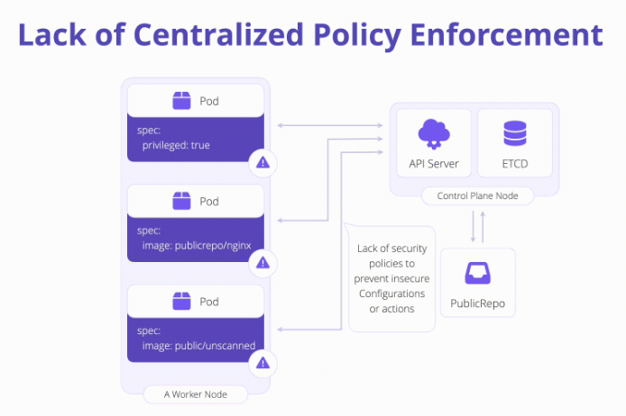

# K04: Policy Enforcement

# Problem

The inability to detect, remediate, and prevent misconfigurations from a central location can leave clusters open to compromise.

# Prevent

**Detect and block misconfigured workloads upon admission.** This is typically handled by an Admission Controller on the Kubernetes API itself. Built-in functionality exists as part of the Kubernetes API itself called [Pod Security Standards](https://kubernetes.io/docs/concepts/security/pod-security-standards/) to enforce policy as part of the [Pod Security Admission Controller](https://kubernetes.io/docs/concepts/security/pod-security-admission/) in the cluster itself.

Use projects such as:
- [Gatekeeper](https://open-policy-agent.github.io/gatekeeper/website/docs/)
- [Kyverno](https://kyverno.io/)
- [Kubewarden](https://www.kubewarden.io/)

# Links

- [K04 Policy Enforcement](https://owasp.org/www-project-kubernetes-top-ten/2022/en/src/K04-policy-enforcement)
