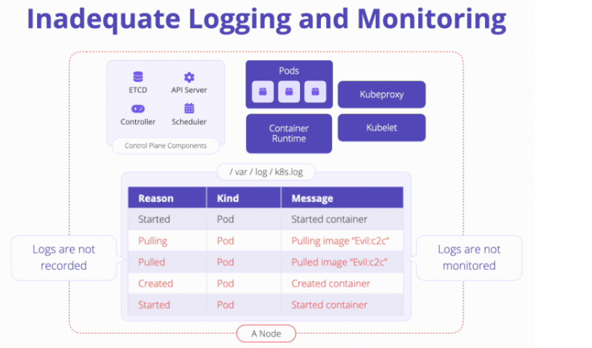

# K05: Inadequate Logging and Monitoring

A Kubernetes environment has the ability to generate logs at a variety of levels from many different components.

# Problem



When logs are not captured, stored, or actively monitored attackers have the ability to exploit vulnerabilities (while going largely undetected). Morover, incident investigation is a challange due to lack of information.

Inadequate logging in the context of Kubernetes occurs when:

- Relevant events such as failed authentication attempts, access to sensitive resources, manual deletion or modification of Kubernetes resources are not logged
- Logs and traces of running workloads are not monitored for suspicious activity
- Alerting thresholds are not in place or escalated appropriately
- Logs are not centrally stored and protected against tampering
- Logging infrastructure is disabled completely

# Exploit

## Docker

```shell
docker build -t tomasz2101/hackme-app:v1 -f devops/docker/Dockerfile .
docker run --rm  --detach --name hackme-app --publish 8080:80 tomasz2101/hackme-app:v1
docker logs -f hackme-app
```
Visit app at [localhost:8080](http://localhost:8080/)

## Kubernetes

```shell
cat devops/docker/Dockerfile; echo
docker build -t tomasz2101/hackme-app:v1 -f devops/docker/Dockerfile .
docker push tomasz2101/hackme-app:v1

cat devops/k8s/manifests/k05/hack.pod.yaml; echo
kubectl apply -f devops/k8s/manifests/k05/hack.pod.yaml
kubectl port-forward pod/hackme-app 8080:80 &
kubectl logs -f hackme-app
```

Visit app at [localhost:8080](http://localhost:8080/)

# Prevent

Enabled and configured below sources:

- **Kubernetes Audit Logs:** Ensure logs are monitoring for anomalous or unwanted API calls such authorization failures - this could mean that an attacker is trying to abuse stolen credentials
- **Kubernetes Events:** To track resource state changes and errors, as well as any informational messages
- **Application & Container Logs:** Capturing application's logs that is written to stdout and stderr streams
- **Operating System Logs:**  Logs from systemd (`journalctl -u command`) can provide info about node status
- **Cloud Provider Logs:** Kubernetes managed in cloud (AKS, etc.) you can find a number of additional logging streams available for consumption
- **Network Logs:** If you are working with proxy or ingress components, you should use the stdout and stderr to capture and ship these logs. Projects such as [eBPF](https://ebpf.io/) aim to provide consumable network and kernel logs.

# Links

- [K05 Inadequate Logging](https://owasp.org/www-project-kubernetes-top-ten/2022/en/src/K05-inadequate-logging)