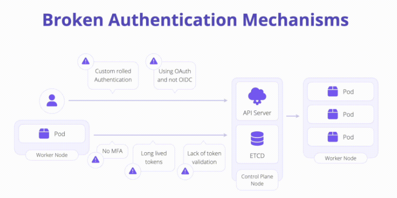

# K06: Broken Authentication

Kubernetes authentication flows is distinguished between humans and service accounts

1. Human Authentication

    Human can authenticate to a cluster using OpenID Connect (OIDC), Certificates, cloud IAM, and ServiceAccount tokens methods.

1. Service Account Authentication

    A Service Authentication (SA) is an authentication mechanism typically reserved for **container-to-api** authentication from inside the cluster. SA tokens can be presented to the Kubernetes API as an authentication mechanism when configured with RBAC appropriately.

# Problem

# Prevent

- **Avoid using certificates for end user authentication:** Currently the Kubernetes API has no way to revoke certificates - making hard to re-key the cluster in the event of a compromise or leak of private key material. Certificates are cumbersome to configure, sign, and distribute. A certificate may be used as a “Break Glass” authentication mechanism but **not for primary auth.**
- **Never roll your own authentication:** Use what is supported and widely adopted.
- **Enforce MFA when possible:**  Force humans to provide a second method of authentication (typically part of OIDC).
- **Don’t use Service Account tokens from outside of the cluster:** Using the long-lived SA from outside of the cluster opens your cluster up to significant risk.
- **Authenticate users and external services using short-lived tokens:** This way if a credential is leaked, it is possible that it may not be replayed in the time necessary to compromise the account.

# Links

- [K06 Broken Authentication](https://owasp.org/www-project-kubernetes-top-ten/2022/en/src/K06-broken-authentication)
