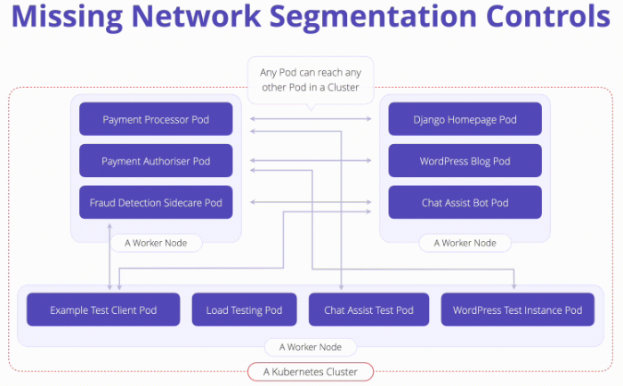

# K07: Network Segmentation

Traffic within the context of a Kubernetes cluster can happen between pods, namespaces, labels, and IP ranges.

# Problem

Kubernetes networking is flat by default, workloads can communicate to another without constraint. Attackers can leverage this behavior to probe the internal network, traverse to other running containers, or invoke private APIs.

# Prevent

To minimize the blast radius of compromised container and stop lateral movement while allowing valid traffic to route as expected you could do:

1. **Native Controls (NetworkPolicies):** Kubernete's Network policies behave like firewall rules, they control how pods communicate. Network Policies should be defined to limit pod communication to only defined assets, while denying everything that isn’t explicitly configured. **Without network policies, any pod can talk to any other pod.**
1. **Native Controls (Multi-Cluster):** This is a viable option when separating different tenants based on risk at cost of complexity when working with tightly coupled microservices, This method truly enforces network isolation within Kubernetes by utilize separate clusters.
1. **Container Network Interface (CNI) Plugins:**  CNI is software-defined specification that is used to configure access to networking resources, allowing or disallowing network access within Kubernetes. A CNI is typically needed if an operator would like to implement Kubernetes Network Policies (above). When choosing a CNI, it is most important to understand the feature-set that you are seeking from a security perspective and the resource overhead and maintenance related to using the plugin.
1. **Service Mesh:**  offers different ways to segment network traffic within a Kubernetes cluster and all come with pros and cons.

# Links

- [K07 Network Segmentation](https://owasp.org/www-project-kubernetes-top-ten/2022/en/src/K07-network-segmentation)