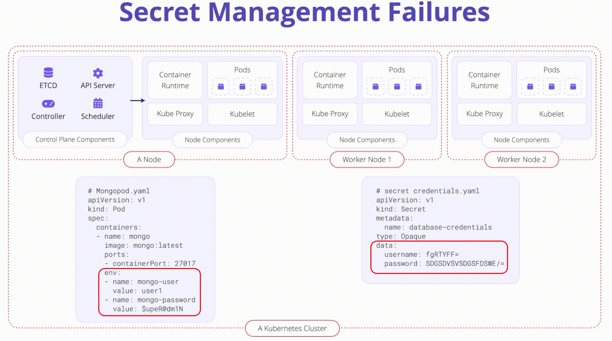

# K08: Secrets Management

Kubernetes' secret is an object that contains sensitive data (password or token), and need to be handled with extreme caution.

# Problem

The username and password values in the below example are base64 encoded and thus not encrypted (by default). This makes checking secrets into version control or other systems very dangerous.

```yaml
apiVersion: v1
kind: Secret
metadata:
  name: top-secret
data:
  username: bXktdXNlcm5hbWUK
  password: bXktcGFzc3dvcmQK
type: Opaque
```



# Exploit

For better usecase goto [k03.hack1](../owasp-k8s-top-10-goat/k03.hack1.md)

## Kubernetes

```shell
docker build -t tomasz2101/hackme-app:v1 -f devops/docker/Dockerfile .
docker push tomasz2101/hackme-app:v1

cat devops/k8s/manifests/k08/hack.pod.yaml; echo
kubectl apply -f devops/k8s/manifests/k08/hack.pod.yaml
{
  kubectl exec hackme-app -- ls -l /var/run/secrets/kubernetes.io/serviceaccount;
  kubectl exec hackme-app -- cat /var/run/secrets/kubernetes.io/serviceaccount/namespace; echo;
  kubectl exec hackme-app -- cat /var/run/secrets/kubernetes.io/serviceaccount/token; echo;
}
```

# Prevent

1. Encrypt secrets at rest

    Always encrypt your data at rest and in transit. e.g backups - consider using full disk encryption where possible. Since v1.13 Kubernetes supports encryption at rest. Kubernetes resources are encrypted in etcd. 

1. Address Security Misconfigurations

    Configuration across clusters is predicament to security. Vulnerabilities, image security, and policy enforcement need to be in place.
    
    Locked down RBAC configuration. Keep all Service Account and end user access to least privilege. 
    
    Always audit the RBAC configuration of third-party plugins and software installed in the cluster to ensure access to Kubernetes secrets is not granted unnecessarily.

# Links

- [K08 Secrets Management](https://owasp.org/www-project-kubernetes-top-ten/2022/en/src/K08-secrets-management)