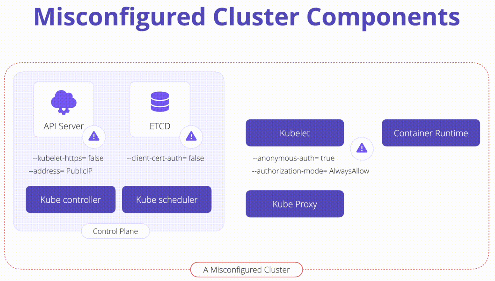

# K09: Misconfigured Cluster Components

# Problem

A Kubernetes cluster is compromised of many different components, and misconfigurations of these components can lead to kubernetes cluster being compromise.



# Exploit

1. Kubelet

    ```yaml
    # Allows for non-authenticated requests to the Kubelet. BAD!
    --anonymous-auth=true

    # Disabled requests authorization. BAD!
    --authorization-mode=AlwaysAllow
    ```
1. ETCD

    ```yaml
    # Disabke check for all incoming HTTPS requests for a client certificate signed by the trusted CA. BAD!
    --client-cert-auth=false
    ```

1. API Server

    ```yaml
    # Allow for none https trafic betwenn API server and Kubelet BAD!
    --kubelet-https=false

    # Exosing API on public IP address. BAD!
    --address=PublicIP
    ```

# Prevent

[CIS Benchmark](https://www.cisecurity.org/benchmark/kubernetes) scans and audits kubernetes cluster with focused on component misconfigurations.

Infrastructure-as-Code can also help centralize Kubernetes configuration and remediation giving security teams visibility into how clusters are created and maintained.

# Links

- [K09 Misconfigured Cluster Components](https://owasp.org/www-project-kubernetes-top-ten/2022/en/src/K09-misconfigured-cluster-components)
- [Kubernetes Components](https://kubernetes.io/docs/concepts/overview/components/)
- [Control plaing references](https://kubernetes.io/docs/reference/command-line-tools-reference/)
- [ETCD Security](https://etcd.io/docs/v3.2/op-guide/security/)
