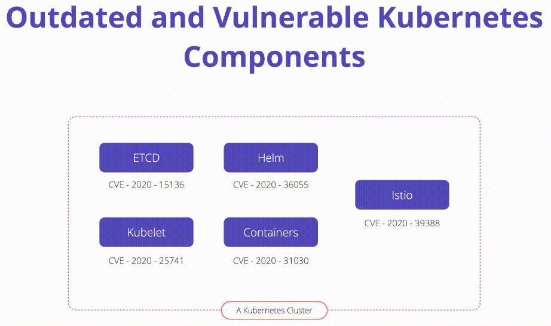

# K10: Vulnerable Components

# Problem

Vulnerabilities exist in Kubernetes components and third-party software running inside of a Kubernetes cluster. 

# Exploit

- ArgoCD
- ingress-nginx
- Istio 

# Prevent

It is up to administrators to follow CVE databases, disclosures, and updates closely and have a plan for patch management.

1. **Track CVE databases:** Kubernetes and the associated components cannot be left out of your existing CVE vulnerability scanning process
1. **Continuous scanning:** OPA Gatekeeper can be used to write custom rules which discover vulnerable components in a cluster. These should be run on a regular cadence and tracked by the security operations team
1. **Minimize third-party dependencies:** Audited third-party software independently before deployment for overly permissive RBAC, low-level kernel access, and historical vulnerability disclosure records

# Links

- [K10 Vulnerable Components](https://owasp.org/www-project-kubernetes-top-ten/2022/en/src/K10-vulnerable-components)